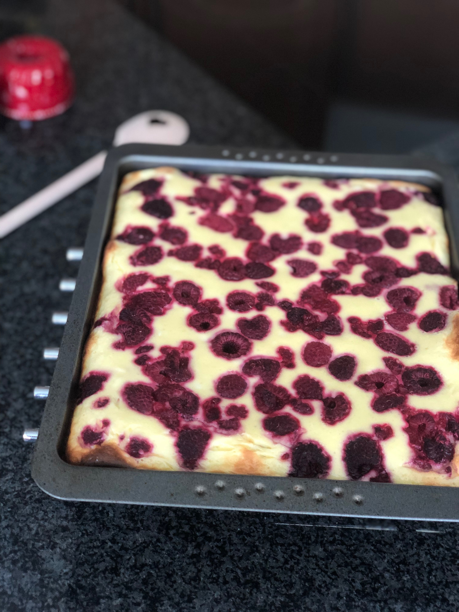
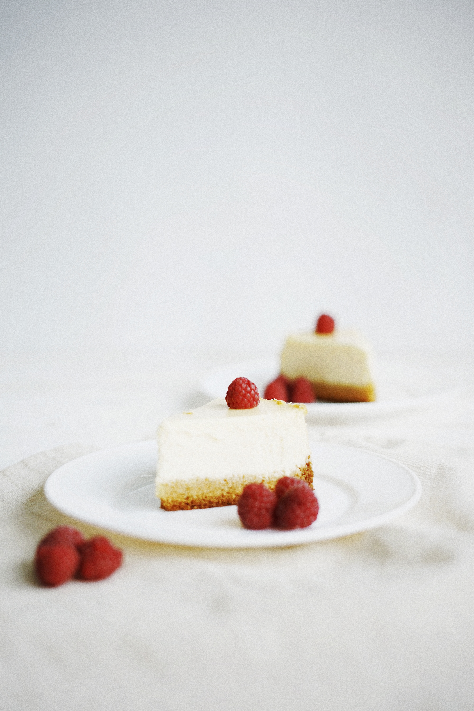

# Ein Rezept für Himbeer-Cheesecake-Brownies

Diese leckeren Himbeer-Cheesecake-Brownies bestehen aus zwei verschiedenen Rezepten. Zum einen aus einem Cheesecake Rezept mit Himbeeren und zum anderem einem klassischen Brownie Rezept.

Das Rezept ist einfallsreicher, als normaler Cheesecake und normale Brownies und verbindet damit verschiedene Geschmäcker. Zum einen die Süße, durch die Schokolade der Brownies, und zum anderen die Fluffigkeit des Cheesecakes, welcher durch die Himbeeren eine Fruchtigkeit mit ins Spiel bringt.

